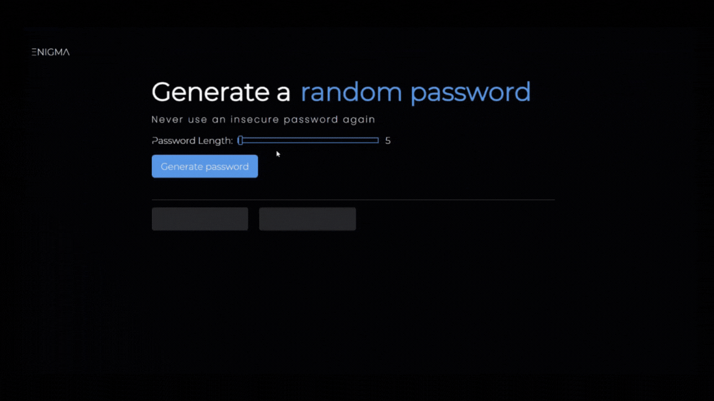

# Password Generator
This password generator is built using vanilla JavaScript and allows you to generate strong, random passwords

## Table of contents
- [Overview](#overview)
  - [Description](#description)
  - [Features](#features)
  - [Demo](#demo)
  - [Links](#links)
- [Built with](#built-with)
- [Installation](#installation)
- [Usage](#usage)
- [Author](#author)
## Overview
### Description
This password generator is a simple yet powerful tool to help you create strong, random passwords. It is built using vanilla JavaScript, which means it does not require any additional frameworks or libraries. The generator allows you to choose the length of your password between 5 and 20 characters and generates two different password options for you to choose from. You can easily copy the password of your choice by clicking on it.

The generator also includes a feature that ensures that the passwords generated are random and unique, it uses a combination of letters, numbers and special characters to create the password. This makes the passwords generated by the generator much stronger than regular human generated passwords which are prone to be guessable.

The user interface is simple and easy to use, making it accessible to users of all skill levels. Whether you need a password for a personal account or for a work-related one, this password generator can help you create a secure and unique password in just a few seconds.

### Features 
- Choose the length of your password (between 5 and 20 characters)
- Generate two different password options
- Easily copy the password of your choice by clicking on it
### Demo

### Links

- Solution URL: [Github](https://github.com/fatima-xs/password-generator-app)
- Live Site URL: [Netlify](https://password-generator-app-fatima.netlify.app/)

## Built with
 
 
 

## Installation
- Clone or download the repository to your local machine.
- Open the index.html file in your browser to launch the password generator.
- You can also run the project on a local server.
- No additional installation steps are required as this is a pure JavaScript implementation.
    
## Usage
- Open the password generator in your browser
- Select the desired length for your password
- Click the "Generate" button to generate two different password options
- Select the password of your choice by clicking on it
- Click the "Copy" button to copy the password to your clipboard
## Author
**Fatimata Ndiaye**

